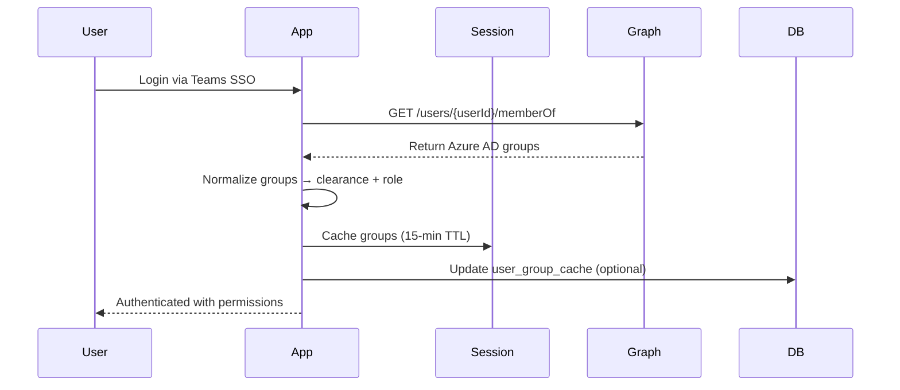
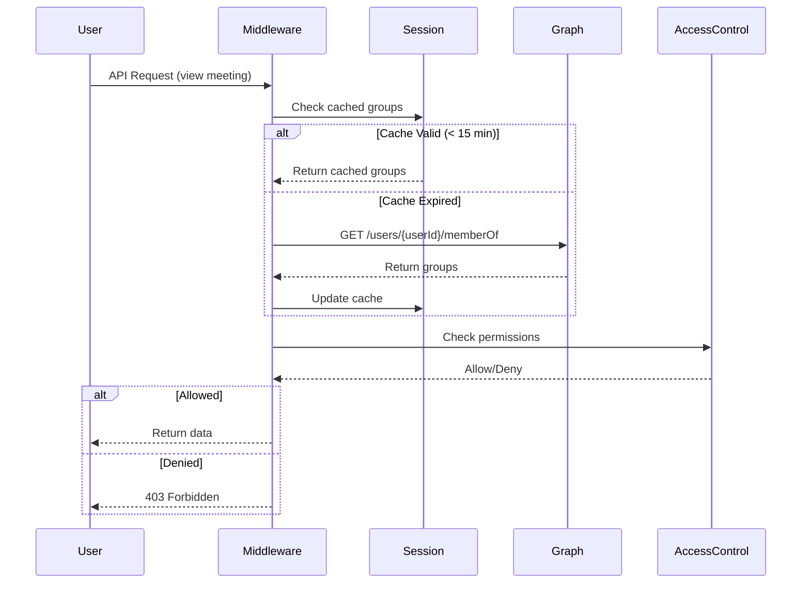

# Azure AD Groups Architecture - Multi-Level Access Control

## Executive Summary

This document outlines the architecture for transitioning from database-stored clearance/role to **real-time Azure AD group-based access control** for the DOD Teams Meeting Minutes system. This approach scales to 300,000+ users and provides centralized security management.

---

## Current State (Database-Based)

### Limitations
- ✅ Clearance Level: Stored in `users.clearanceLevel` (UNCLASSIFIED, CONFIDENTIAL, SECRET, TOP_SECRET)
- ✅ Role: Stored in `users.role` (viewer, approver, auditor, admin)
- ❌ **Scalability**: Updating 300K users requires massive DB operations
- ❌ **Centralization**: IT must update database instead of Azure AD
- ❌ **Real-Time**: Changes require database updates (not immediate)
- ❌ **Audit Trail**: Limited to application logs

### Current Implementation
```typescript
// server/services/accessControl.ts
canViewMeeting(user: AuthenticatedUser, meeting: Meeting): boolean {
  // Uses user.clearanceLevel and user.role from database
  const userClearance = CLEARANCE_LEVELS[user.clearanceLevel];
  const meetingClassification = CLEARANCE_LEVELS[meeting.classificationLevel];
  return userClearance >= meetingClassification;
}
```

---

## Target Architecture (Azure AD Groups)

### Design Principles
1. **Primary Source**: Azure AD groups (authoritative)
2. **Performance**: Session cache (15-min TTL) + optional DB fallback
3. **Security**: Fail-closed (deny access if groups unavailable)
4. **Scalability**: No per-user DB updates (300K+ users)
5. **Audit**: Azure AD logs + application access logs

### Azure AD Security Groups

#### Clearance-Level Groups
```
DOD-Clearance-UNCLASSIFIED   → Can view UNCLASSIFIED meetings
DOD-Clearance-CONFIDENTIAL   → Can view UNCLASSIFIED + CONFIDENTIAL
DOD-Clearance-SECRET         → Can view UNCLASSIFIED + CONFIDENTIAL + SECRET
DOD-Clearance-TOP_SECRET     → Can view ALL classification levels
```

**Hierarchy**: TOP_SECRET > SECRET > CONFIDENTIAL > UNCLASSIFIED

#### Role Groups
```
DOD-Role-Viewer              → Default role, view attended meetings only
DOD-Role-Approver            → Can approve/reject meeting minutes
DOD-Role-Auditor             → Can view ALL meetings (entire archive)
DOD-Role-Admin               → Full system access + user management
```

**Access Levels**:
- **Viewer**: Only meetings they attended
- **Approver**: Can approve minutes + view attended meetings
- **Auditor**: Can view ALL meetings (subject to clearance)
- **Admin**: Full access (manage users, configure integrations)

---

## Microsoft Graph API Integration

### Graph API Endpoint
```http
GET https://graph.microsoft.com/v1.0/users/{userId}/memberOf
```

**Response Structure**:
```json
{
  "value": [
    {
      "id": "abc123",
      "displayName": "DOD-Clearance-SECRET",
      "mailNickname": "DOD-Clearance-SECRET"
    },
    {
      "id": "def456",
      "displayName": "DOD-Role-Approver",
      "mailNickname": "DOD-Role-Approver"
    }
  ],
  "@odata.nextLink": "..."
}
```

### Pagination Handling
- **Page Size**: 100 groups per request (Graph API default)
- **Max Iterations**: 50 pages (5,000 groups max per user)
- **Timeout**: 30 seconds total

### Throttling & Error Handling
```typescript
// Retry on 429 (Too Many Requests)
if (response.status === 429) {
  const retryAfter = response.headers['retry-after'] || 60;
  await delay(retryAfter * 1000);
  return retry();
}

// Fail-closed on errors
catch (error) {
  console.error('[GraphGroupSync] Failed to fetch groups:', error);
  return { clearanceLevel: null, role: null }; // Deny access
}
```

---

## Caching Strategy

### Hybrid Approach
```
┌─────────────────┐
│  Azure AD       │ ← Authoritative Source
│  (Graph API)    │
└────────┬────────┘
         │
         ▼
┌─────────────────┐
│  Session Cache  │ ← 15-min TTL (fast, in-memory)
│  (Express)      │
└────────┬────────┘
         │
         ▼ (optional fallback)
┌─────────────────┐
│  Database Cache │ ← Updated on login (offline queries)
│  (PostgreSQL)   │
└─────────────────┘
```

### Session Cache (Primary)
```typescript
interface SessionData {
  userId: string;
  accessToken: string;
  azureAdGroups?: {
    clearanceLevel: string | null;  // Highest clearance from groups
    role: string | null;             // Highest role from groups
    groupNames: string[];            // Raw group names for audit
    cachedAt: Date;                  // Cache timestamp
    expiresAt: Date;                 // TTL expiration (15 min)
  };
}
```

**Cache Invalidation**:
- **TTL**: 15 minutes (balance freshness vs API calls)
- **Manual**: Force refresh on sensitive operations (approve minutes, export)
- **Logout**: Clear session cache

### Database Fallback (Optional)
```sql
-- New table: user_group_cache
CREATE TABLE user_group_cache (
  user_id VARCHAR PRIMARY KEY REFERENCES users(id),
  clearance_level TEXT,           -- Cached highest clearance
  role TEXT,                       -- Cached highest role
  group_names JSONB,               -- Raw group names for audit
  cached_at TIMESTAMP NOT NULL,
  expires_at TIMESTAMP NOT NULL
);
```

**When to Use**:
- Background jobs (no session available)
- Analytics queries (performance)
- Offline scenarios (Graph API unavailable)

**Update Strategy**:
- Update on every login
- Expire after 1 hour
- Never trust expired cache (re-fetch from Graph)

---

## Group Normalization

### Clearance Level Extraction
```typescript
function extractClearanceLevel(groupNames: string[]): string | null {
  const clearanceGroups = groupNames.filter(g => 
    g.startsWith('DOD-Clearance-')
  );
  
  // Return HIGHEST clearance level
  if (clearanceGroups.includes('DOD-Clearance-TOP_SECRET')) return 'TOP_SECRET';
  if (clearanceGroups.includes('DOD-Clearance-SECRET')) return 'SECRET';
  if (clearanceGroups.includes('DOD-Clearance-CONFIDENTIAL')) return 'CONFIDENTIAL';
  if (clearanceGroups.includes('DOD-Clearance-UNCLASSIFIED')) return 'UNCLASSIFIED';
  
  return null; // No clearance group = deny access
}
```

### Role Extraction
```typescript
function extractRole(groupNames: string[]): string | null {
  const roleGroups = groupNames.filter(g => 
    g.startsWith('DOD-Role-')
  );
  
  // Return HIGHEST role (admin > auditor > approver > viewer)
  if (roleGroups.includes('DOD-Role-Admin')) return 'admin';
  if (roleGroups.includes('DOD-Role-Auditor')) return 'auditor';
  if (roleGroups.includes('DOD-Role-Approver')) return 'approver';
  if (roleGroups.includes('DOD-Role-Viewer')) return 'viewer';
  
  return 'viewer'; // Default role if no role group
}
```

---

## Authorization Flow

### Login Flow (Fetch & Cache Groups)


### Request Authorization Flow


### Force Refresh Flow (Sensitive Operations)
```typescript
// Approval workflow - force refresh groups
async function approveMeetingMinutes(req: Request, res: Response) {
  // Force refresh groups (bypass cache)
  const groups = await graphGroupSyncService.fetchUserGroups(
    req.user.azureAdId, 
    { forceRefresh: true }
  );
  
  // Check if still authorized
  if (groups.role !== 'approver' && groups.role !== 'admin') {
    return res.status(403).json({ 
      error: 'Access denied: Approver role revoked' 
    });
  }
  
  // Proceed with approval...
}
```

---

## Implementation Touch Points

### 1. New Service: `GraphGroupSyncService`
**File**: `server/services/graphGroupSync.ts`

**Responsibilities**:
- Fetch user groups from Graph API (`GET /users/{userId}/memberOf`)
- Handle pagination (up to 50 pages)
- Normalize groups → clearance + role
- Return typed result with error handling

**Interface**:
```typescript
interface UserGroups {
  clearanceLevel: string | null;
  role: string | null;
  groupNames: string[];
  source: 'graph' | 'cache' | 'fallback';
}

class GraphGroupSyncService {
  async fetchUserGroups(
    azureAdId: string, 
    options?: { forceRefresh?: boolean }
  ): Promise<UserGroups>;
  
  async syncUserGroupsToCache(userId: string, azureAdId: string): Promise<void>;
}
```

### 2. Update: `authenticateUser` Middleware
**File**: `server/middleware/authenticateUser.ts`

**Changes**:
- On login: Fetch Azure AD groups via `GraphGroupSyncService`
- Store in session: `req.session.azureAdGroups = { ... }`
- Extend `req.user` with cached groups

**Session Extension**:
```typescript
req.session.azureAdGroups = {
  clearanceLevel: 'SECRET',
  role: 'approver',
  groupNames: ['DOD-Clearance-SECRET', 'DOD-Role-Approver'],
  cachedAt: new Date(),
  expiresAt: new Date(Date.now() + 15 * 60 * 1000) // 15 min TTL
};
```

### 3. Update: `AccessControlService`
**File**: `server/services/accessControl.ts`

**Changes**:
- Replace `user.clearanceLevel` with `user.azureAdGroups.clearanceLevel`
- Replace `user.role` with `user.azureAdGroups.role`
- Add cache expiry check (re-fetch if expired)
- Add audit logging for access decisions

**New Method**:
```typescript
async ensureFreshGroups(user: AuthenticatedUser): Promise<void> {
  const cache = req.session.azureAdGroups;
  
  if (!cache || cache.expiresAt < new Date()) {
    // Re-fetch from Graph API
    const groups = await graphGroupSyncService.fetchUserGroups(user.azureAdId);
    req.session.azureAdGroups = groups;
  }
}
```

### 4. Update: Database Schema (Optional Cache)
**File**: `shared/schema.ts`

**New Table**:
```typescript
export const userGroupCache = pgTable("user_group_cache", {
  userId: varchar("user_id").primaryKey().references(() => users.id),
  clearanceLevel: text("clearance_level"),
  role: text("role"),
  groupNames: jsonb("group_names").$type<string[]>(),
  cachedAt: timestamp("cached_at").notNull(),
  expiresAt: timestamp("expires_at").notNull(),
});
```

### 5. Update: API Endpoints
**Files**: All endpoints in `server/routes.ts`

**Changes**:
- Add access control checks using Azure AD groups
- Log access decisions (allow/deny)
- Handle cache expiry gracefully

**Example**:
```typescript
app.get("/api/meetings", authenticateUser, async (req, res) => {
  // Ensure fresh groups (check TTL)
  await accessControlService.ensureFreshGroups(req);
  
  // Filter meetings based on Azure AD groups
  const meetings = await storage.getMeetings();
  const filteredMeetings = meetings.filter(meeting => 
    accessControlService.canViewMeeting(req.user, meeting)
  );
  
  console.log(`[ACCESS] User ${req.user.email} (${req.user.azureAdGroups.role}) viewing ${filteredMeetings.length}/${meetings.length} meetings`);
  
  res.json(filteredMeetings);
});
```

### 6. Update: Frontend (No Major Changes)
**Files**: `client/src/*`

**Changes**:
- Frontend receives filtered data from API (already secured)
- No client-side permission checks needed (server-side enforcement)
- UI can show user's permissions in settings/profile page

---

## Security Considerations

### Fail-Closed Policy
```typescript
// If Graph API fails, DENY access (fail-closed)
try {
  const groups = await fetchUserGroups(azureAdId);
  return groups;
} catch (error) {
  console.error('[SECURITY] Failed to fetch groups, denying access');
  return { clearanceLevel: null, role: null }; // Deny
}
```

### Audit Logging
```typescript
// Log ALL access decisions
console.log(`[ACCESS] ${allowed ? 'ALLOW' : 'DENY'} - User: ${user.email}, Clearance: ${user.azureAdGroups.clearanceLevel}, Meeting: ${meeting.id}, Classification: ${meeting.classificationLevel}`);
```

### Cache Invalidation
- **15-Minute TTL**: Balance freshness vs performance
- **Force Refresh**: Sensitive operations (approve, export, admin actions)
- **Logout Clear**: Remove all cached data on logout

---

## Rollout Plan

### Phase 1: Infrastructure (Tasks 4.1-4.3)
1. Create `GraphGroupSyncService` with pagination + throttling
2. Extend session cache with `azureAdGroups`
3. Add optional `user_group_cache` table

### Phase 2: Integration (Tasks 4.4-4.5)
1. Update `AccessControlService` to use Azure AD groups
2. Update `authenticateUser` middleware to fetch/cache groups on login

### Phase 3: Enforcement (Tasks 4.6-4.7)
1. Add access control checks to ALL API endpoints
2. Update frontend to reflect filtered data
3. Add audit logging for all access decisions

### Phase 4: Testing (Task 4.8)
1. Unit tests: Group normalization, cache TTL, pagination
2. Integration tests: Graph API mock, cache behavior
3. E2E tests: Login → fetch groups → access control → logout

---

## Testing Strategy

### Mock Mode (Development)
```typescript
// Mock Azure AD groups for testing
if (process.env.USE_MOCK_SERVICES === 'true') {
  return {
    clearanceLevel: 'SECRET',
    role: 'approver',
    groupNames: ['DOD-Clearance-SECRET', 'DOD-Role-Approver'],
    source: 'mock'
  };
}
```

### E2E Test Scenarios
1. **Happy Path**: User with clearance → can view appropriate meetings
2. **Insufficient Clearance**: SECRET user → cannot view TOP_SECRET meeting
3. **Cache Expiry**: After 15 min → re-fetch groups from Graph
4. **Force Refresh**: Approve action → bypass cache, fetch latest groups
5. **Graph API Failure**: API error → deny access (fail-closed)
6. **Role Change**: Revoking approver role → immediately lose approval privileges (after cache refresh)
7. **Concurrent Requests**: Multiple requests → use cached groups (no stampede)

---

## Migration Path

### Database Migration (Soft Transition)
```typescript
// Keep existing clearanceLevel/role fields as fallback
// Use Azure AD groups as primary source

function getUserClearance(user: AuthenticatedUser): string {
  // Primary: Azure AD groups
  if (user.azureAdGroups?.clearanceLevel) {
    return user.azureAdGroups.clearanceLevel;
  }
  
  // Fallback: Database field (during migration)
  return user.clearanceLevel || 'UNCLASSIFIED';
}
```

### Gradual Rollout
1. **Week 1**: Deploy with dual-mode (Azure AD + DB fallback)
2. **Week 2**: Monitor logs, fix issues
3. **Week 3**: Remove DB fallback, Azure AD only
4. **Week 4**: Deprecate `users.clearanceLevel` and `users.role` columns

---

## Performance Metrics

### Target Metrics
- **Cache Hit Ratio**: > 95% (session cache)
- **Graph API Calls**: < 1,000/day (for 300K users)
- **Average Latency**: < 50ms (session cache lookup)
- **P99 Latency**: < 500ms (including Graph API re-fetch)

### Monitoring
```typescript
// Log cache statistics
console.log(`[PERF] Cache hit ratio: ${cacheHits}/${totalRequests} (${hitRatio}%)`);
console.log(`[PERF] Graph API calls: ${graphApiCalls}/day`);
```

---

## Conclusion

This architecture provides:
- ✅ **Scalability**: No DB updates for 300K+ users
- ✅ **Centralization**: IT manages groups in Azure AD
- ✅ **Real-Time**: Changes effective within 15 minutes (cache TTL)
- ✅ **Audit Trail**: Azure AD logs + application access logs
- ✅ **Performance**: Session cache (< 50ms) + optional DB fallback
- ✅ **Security**: Fail-closed policy, audit logging, force refresh

**Next Steps**: Implement Task 4.2 (GraphGroupSyncService)
