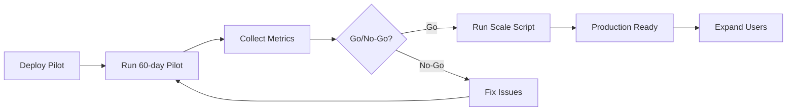

# Pilot to Production Scaling Guide
## Seamless Transition from 100 Users to 300,000 Users

**Document Version:** 1.0  
**Last Updated:** January 2025  
**Classification:** UNCLASSIFIED

---

## Overview

This document ensures your pilot deployment can scale to production **without code changes** - only configuration and infrastructure changes are needed.

### Design Principles

```yaml
✅ Same Codebase: Pilot and production use identical code
✅ Configuration-Driven: Scale via environment variables only
✅ Infrastructure-as-Code: All resources defined in scripts
✅ Zero Data Loss: Clear migration path for pilot data
✅ One-Command Scale: Single script to upgrade resources
✅ Rollback Capability: Can downgrade if needed
```

---

## Architecture: Pilot vs Production

### What Stays the SAME

| Component | Details |
|-----------|---------|
| **Application Code** | Identical - no code changes needed |
| **Database Schema** | Same tables, same structure |
| **API Endpoints** | Same routes and logic |
| **Authentication** | Same Azure AD integration |
| **Graph API Integration** | Same webhooks and permissions |
| **SharePoint Structure** | Same document library schema |
| **Docker Image** | Same container image |

### What Changes (Configuration Only)

| Component | Pilot | Production | Change Method |
|-----------|-------|------------|---------------|
| **App Service SKU** | B3 (1 instance) | P3v3 (2-20 instances) | `az appservice plan update` |
| **Database SKU** | Burstable B2s | GP D4s (HA) | `az postgres flexible-server update` |
| **OpenAI Capacity** | 10k TPM | 100k TPM | `az cognitiveservices account deployment update` |
| **Auto-scaling** | Disabled | Enabled | `az monitor autoscale create` |
| **High Availability** | Disabled | Enabled | `az postgres flexible-server update` |
| **Load Balancer** | Optional | Application Gateway | `az network application-gateway create` |
| **Monitoring Retention** | 30 days | 90 days | `az monitor log-analytics workspace update` |
| **Backup Retention** | 7 days | 30 days | `az postgres flexible-server update` |

---

## Environment-Driven Configuration

### Single Codebase Strategy

**File:** `config/environment.ts`

```typescript
// Configuration that changes between pilot and production
export const config = {
  // Environment detection
  environment: process.env.NODE_ENV || 'development',
  isPilot: process.env.PILOT_MODE === 'true',
  
  // Feature flags
  features: {
    // Pilot-only features
    manualTrigger: process.env.PILOT_MODE === 'true',
    detailedLogging: process.env.PILOT_MODE === 'true',
    feedbackPrompts: process.env.PILOT_MODE === 'true',
    
    // Production-only features
    autoScaling: process.env.PILOT_MODE !== 'true',
    geoReplication: process.env.PILOT_MODE !== 'true',
    advancedMonitoring: process.env.PILOT_MODE !== 'true',
  },
  
  // Resource limits (auto-adjusted)
  limits: {
    maxConcurrentAI: process.env.PILOT_MODE === 'true' ? 5 : 50,
    maxMeetingSize: process.env.PILOT_MODE === 'true' ? 500 : 2000, // MB
    maxAttendeesPerMeeting: process.env.PILOT_MODE === 'true' ? 100 : 500,
    aiTimeoutSeconds: 120,
  },
  
  // User restrictions
  access: {
    requirePilotGroup: process.env.PILOT_MODE === 'true',
    pilotGroupName: process.env.PILOT_USER_GROUP || 'Teams-Minutes-Pilot-Users',
  },
};
```

### Environment Variables

**Pilot (.env.pilot):**
```bash
NODE_ENV=production
PILOT_MODE=true
PILOT_USER_GROUP=Teams-Minutes-Pilot-Users
MAX_PILOT_MEETINGS=1000
ENVIRONMENT_NAME=pilot
```

**Production (.env.production):**
```bash
NODE_ENV=production
PILOT_MODE=false
PILOT_USER_GROUP=  # Empty - no restrictions
MAX_PILOT_MEETINGS=  # Empty - unlimited
ENVIRONMENT_NAME=production
```

---

## One-Command Scaling Scripts

### Script 1: Scale Up to Production

**File:** `scripts/scale-to-production.sh`

```bash
#!/bin/bash
# Scale pilot resources to production in one command

RESOURCE_GROUP="rg-teams-minutes-pilot"  # Will rename to prod
LOCATION="usgovvirginia"

echo "🚀 Scaling to Production..."
echo "================================"

# Step 1: Rename resource group (optional)
read -p "Rename resource group to 'rg-teams-minutes-prod'? (y/n) " -n 1 -r
echo
if [[ $REPLY =~ ^[Yy]$ ]]; then
  az group update \
    --name $RESOURCE_GROUP \
    --tags Environment=Production Phase=Production
  RESOURCE_GROUP="rg-teams-minutes-prod"
fi

# Step 2: Scale App Service Plan (B3 → P3v3)
echo "📈 Scaling App Service Plan..."
az appservice plan update \
  --resource-group $RESOURCE_GROUP \
  --name plan-teams-pilot \
  --sku P3V3 \
  --number-of-workers 2

# Step 3: Enable Auto-scaling
echo "🔄 Enabling Auto-scaling..."
az monitor autoscale create \
  --resource-group $RESOURCE_GROUP \
  --resource plan-teams-pilot \
  --resource-type Microsoft.Web/serverfarms \
  --name autoscale-teams-prod \
  --min-count 2 \
  --max-count 20 \
  --count 2

# Add CPU scaling rule
az monitor autoscale rule create \
  --resource-group $RESOURCE_GROUP \
  --autoscale-name autoscale-teams-prod \
  --condition "Percentage CPU > 70 avg 5m" \
  --scale out 2

az monitor autoscale rule create \
  --resource-group $RESOURCE_GROUP \
  --autoscale-name autoscale-teams-prod \
  --condition "Percentage CPU < 30 avg 10m" \
  --scale in 1

# Step 4: Scale Database (B2s → D4s with HA)
echo "💾 Scaling Database..."
az postgres flexible-server update \
  --resource-group $RESOURCE_GROUP \
  --name psql-teams-pilot \
  --sku-name Standard_D4s_v3 \
  --tier GeneralPurpose \
  --storage-size 256 \
  --backup-retention 30 \
  --high-availability Enabled \
  --standby-availability-zone 2

# Step 5: Scale OpenAI (10k → 100k TPM)
echo "🤖 Scaling Azure OpenAI..."
az cognitiveservices account deployment update \
  --resource-group $RESOURCE_GROUP \
  --name openai-teams-pilot \
  --deployment-name gpt-4 \
  --sku-capacity 100

# Step 6: Extend Key Vault retention
echo "🔐 Updating Key Vault..."
az keyvault update \
  --resource-group $RESOURCE_GROUP \
  --name kv-teams-pilot \
  --retention-days 90 \
  --enable-purge-protection true

# Step 7: Extend monitoring retention
echo "📊 Updating Monitoring..."
az monitor log-analytics workspace update \
  --resource-group $RESOURCE_GROUP \
  --workspace-name law-teams-minutes \
  --retention-time 90

# Step 8: Update environment variables
echo "⚙️  Updating App Settings..."
az webapp config appsettings set \
  --resource-group $RESOURCE_GROUP \
  --name app-teams-pilot \
  --settings \
    PILOT_MODE=false \
    PILOT_USER_GROUP="" \
    MAX_PILOT_MEETINGS="" \
    ENVIRONMENT_NAME=production

# Step 9: Restart application
echo "🔄 Restarting application..."
az webapp restart \
  --resource-group $RESOURCE_GROUP \
  --name app-teams-pilot

echo "✅ Scaling complete!"
echo "================================"
echo "Your application is now production-ready"
echo ""
echo "Next steps:"
echo "1. Deploy Application Gateway (WAF)"
echo "2. Configure custom domain"
echo "3. Enable geo-replication"
echo "4. Run production smoke tests"
```

### Script 2: Infrastructure-as-Code (Terraform Alternative)

**File:** `infrastructure/production-upgrade.bicep`

```bicep
// Bicep template to upgrade pilot to production
param location string = 'usgovvirginia'
param pilotResourceGroup string = 'rg-teams-minutes-pilot'

// App Service Plan - Upgrade to P3v3
resource appServicePlan 'Microsoft.Web/serverfarms@2022-03-01' = {
  name: 'plan-teams-prod'
  location: location
  sku: {
    name: 'P3v3'
    tier: 'PremiumV3'
    capacity: 2
  }
  properties: {
    reserved: true // Linux
  }
}

// Auto-scaling
resource autoScaleSettings 'Microsoft.Insights/autoscalesettings@2022-10-01' = {
  name: 'autoscale-teams-prod'
  location: location
  properties: {
    enabled: true
    targetResourceUri: appServicePlan.id
    profiles: [
      {
        name: 'Auto scale condition'
        capacity: {
          minimum: '2'
          maximum: '20'
          default: '2'
        }
        rules: [
          {
            metricTrigger: {
              metricName: 'CpuPercentage'
              metricResourceUri: appServicePlan.id
              timeGrain: 'PT1M'
              statistic: 'Average'
              timeWindow: 'PT5M'
              timeAggregation: 'Average'
              operator: 'GreaterThan'
              threshold: 70
            }
            scaleAction: {
              direction: 'Increase'
              type: 'ChangeCount'
              value: '2'
              cooldown: 'PT5M'
            }
          }
        ]
      }
    ]
  }
}

// Database - Upgrade to D4s with HA
resource postgresServer 'Microsoft.DBforPostgreSQL/flexibleServers@2022-12-01' = {
  name: 'psql-teams-prod'
  location: location
  sku: {
    name: 'Standard_D4s_v3'
    tier: 'GeneralPurpose'
  }
  properties: {
    version: '14'
    storage: {
      storageSizeGB: 256
    }
    backup: {
      backupRetentionDays: 30
      geoRedundantBackup: 'Enabled'
    }
    highAvailability: {
      mode: 'ZoneRedundant'
      standbyAvailabilityZone: '2'
    }
  }
}
```

**Deploy with:**
```bash
az deployment group create \
  --resource-group rg-teams-minutes-pilot \
  --template-file infrastructure/production-upgrade.bicep
```

---

## Data Migration Strategy

### Option 1: In-Place Upgrade (Recommended)

**Best for:** Keeping pilot data and continuity

```bash
# No data migration needed!
# Just scale resources in place
# All data automatically preserved

# Verify data after scaling
az postgres flexible-server db show \
  --resource-group rg-teams-minutes-prod \
  --server-name psql-teams-prod \
  --database-name teams_minutes
```

### Option 2: Fresh Production Start

**Best for:** Clean production deployment

```bash
# Export pilot data (if needed for analysis)
pg_dump -h psql-teams-pilot.postgres.database.usgovcloudapi.net \
        -U pgadmin \
        -d teams_minutes \
        -f pilot-data-backup.sql

# Deploy fresh production resources
# Use AZURE_GOV_IMPLEMENTATION_PLAN.md

# Optionally import historical data
psql -h psql-teams-prod.postgres.database.usgovcloudapi.net \
     -U pgadmin \
     -d teams_minutes \
     -f pilot-data-backup.sql
```

### Option 3: Parallel Deployment

**Best for:** Zero-downtime transition

```yaml
Phase 1: Deploy new production resources
  - Create new resource group: rg-teams-minutes-prod
  - Deploy all production infrastructure
  - Run in parallel with pilot

Phase 2: Migrate pilot users
  - Week 1: First 1,000 users to production
  - Week 2: Next 10,000 users
  - Week 3: Remaining users
  - Keep pilot running for 2 weeks after full migration

Phase 3: Decommission pilot
  - Export final pilot data
  - Delete pilot resources
  - Redirect pilot URLs to production
```

---

## Testing the Upgrade

### Pre-Upgrade Checklist

```yaml
Before Scaling:
  - [ ] Export pilot data backup
  - [ ] Document current pilot metrics
  - [ ] Test backup restore procedure
  - [ ] Verify all secrets in Key Vault
  - [ ] Take snapshot of current config
  - [ ] Notify pilot users of upgrade window
```

### Post-Upgrade Validation

**File:** `scripts/validate-production.sh`

```bash
#!/bin/bash
# Validate production deployment after scaling

RESOURCE_GROUP="rg-teams-minutes-prod"
APP_NAME="app-teams-prod"
DB_NAME="psql-teams-prod"

echo "🔍 Validating Production Deployment..."

# 1. Check App Service
echo "Checking App Service..."
STATUS=$(az webapp show \
  --resource-group $RESOURCE_GROUP \
  --name $APP_NAME \
  --query state -o tsv)

if [ "$STATUS" == "Running" ]; then
  echo "✅ App Service is running"
else
  echo "❌ App Service is not running: $STATUS"
  exit 1
fi

# 2. Check Database
echo "Checking Database..."
DB_STATUS=$(az postgres flexible-server show \
  --resource-group $RESOURCE_GROUP \
  --name $DB_NAME \
  --query state -o tsv)

if [ "$DB_STATUS" == "Ready" ]; then
  echo "✅ Database is ready"
else
  echo "❌ Database is not ready: $DB_STATUS"
  exit 1
fi

# 3. Check HA configuration
HA_MODE=$(az postgres flexible-server show \
  --resource-group $RESOURCE_GROUP \
  --name $DB_NAME \
  --query highAvailability.mode -o tsv)

if [ "$HA_MODE" == "ZoneRedundant" ]; then
  echo "✅ High Availability enabled"
else
  echo "⚠️  High Availability not enabled: $HA_MODE"
fi

# 4. Check Auto-scaling
AUTOSCALE=$(az monitor autoscale show \
  --resource-group $RESOURCE_GROUP \
  --name autoscale-teams-prod \
  --query enabled -o tsv)

if [ "$AUTOSCALE" == "true" ]; then
  echo "✅ Auto-scaling enabled"
else
  echo "❌ Auto-scaling not enabled"
  exit 1
fi

# 5. Test health endpoint
echo "Testing application health..."
HEALTH_URL="https://$APP_NAME.azurewebsites.us/api/health"
HTTP_CODE=$(curl -s -o /dev/null -w "%{http_code}" $HEALTH_URL)

if [ "$HTTP_CODE" == "200" ]; then
  echo "✅ Application health check passed"
else
  echo "❌ Application health check failed: HTTP $HTTP_CODE"
  exit 1
fi

# 6. Check environment variables
PILOT_MODE=$(az webapp config appsettings list \
  --resource-group $RESOURCE_GROUP \
  --name $APP_NAME \
  --query "[?name=='PILOT_MODE'].value" -o tsv)

if [ "$PILOT_MODE" == "false" ] || [ -z "$PILOT_MODE" ]; then
  echo "✅ Pilot mode disabled"
else
  echo "❌ Pilot mode still enabled"
  exit 1
fi

echo ""
echo "================================"
echo "✅ All validation checks passed!"
echo "Production deployment is healthy"
echo "================================"
```

### Load Testing

**File:** `tests/load-test-production.js`

```javascript
// Simple load test using k6
import http from 'k6/http';
import { check, sleep } from 'k6';

export const options = {
  stages: [
    { duration: '2m', target: 100 },   // Ramp up to 100 users
    { duration: '5m', target: 100 },   // Stay at 100 users
    { duration: '2m', target: 1000 },  // Ramp up to 1000 users
    { duration: '5m', target: 1000 },  // Stay at 1000 users
    { duration: '2m', target: 0 },     // Ramp down
  ],
  thresholds: {
    http_req_duration: ['p(95)<500'], // 95% of requests under 500ms
    http_req_failed: ['rate<0.01'],   // Error rate under 1%
  },
};

export default function () {
  const response = http.get('https://app-teams-prod.azurewebsites.us/api/meetings');
  
  check(response, {
    'status is 200': (r) => r.status === 200,
    'response time OK': (r) => r.timings.duration < 500,
  });
  
  sleep(1);
}
```

**Run with:**
```bash
# Install k6
# On macOS: brew install k6
# On Linux: snap install k6

# Run load test
k6 run tests/load-test-production.js
```

---

## Rollback Plan

### Emergency Rollback (If Issues Arise)

**File:** `scripts/rollback-to-pilot.sh`

```bash
#!/bin/bash
# Emergency rollback to pilot configuration

RESOURCE_GROUP="rg-teams-minutes-prod"

echo "⚠️  Rolling back to pilot configuration..."

# 1. Scale down App Service
az appservice plan update \
  --resource-group $RESOURCE_GROUP \
  --name plan-teams-prod \
  --sku B3 \
  --number-of-workers 1

# 2. Disable auto-scaling
az monitor autoscale delete \
  --resource-group $RESOURCE_GROUP \
  --name autoscale-teams-prod

# 3. Scale down database
az postgres flexible-server update \
  --resource-group $RESOURCE_GROUP \
  --name psql-teams-prod \
  --sku-name Standard_B2s \
  --tier Burstable \
  --high-availability Disabled

# 4. Reduce OpenAI capacity
az cognitiveservices account deployment update \
  --resource-group $RESOURCE_GROUP \
  --name openai-teams-prod \
  --deployment-name gpt-4 \
  --sku-capacity 10

# 5. Re-enable pilot mode
az webapp config appsettings set \
  --resource-group $RESOURCE_GROUP \
  --name app-teams-prod \
  --settings \
    PILOT_MODE=true \
    PILOT_USER_GROUP="Teams-Minutes-Pilot-Users" \
    ENVIRONMENT_NAME=pilot

# 6. Restart
az webapp restart \
  --resource-group $RESOURCE_GROUP \
  --name app-teams-prod

echo "✅ Rollback complete - back to pilot configuration"
```

---

## Cost Comparison Calculator

**File:** `scripts/calculate-scaling-cost.sh`

```bash
#!/bin/bash
# Calculate cost difference between pilot and production

echo "💰 Cost Comparison: Pilot vs Production"
echo "========================================"
echo ""
echo "PILOT (Monthly):"
echo "  App Service B3:        $109"
echo "  PostgreSQL B2s:        $48"
echo "  OpenAI (10k TPM):      $500-1000"
echo "  Other Services:        $50"
echo "  -------------------------------"
echo "  TOTAL:                 $707-1207/month"
echo ""
echo "PRODUCTION (Monthly):"
echo "  App Service P3v3 x2:   $876"
echo "  PostgreSQL D4s (HA):   $580"
echo "  OpenAI (100k TPM):     $3000-5000"
echo "  App Gateway (WAF):     $246"
echo "  Other Services:        $300"
echo "  -------------------------------"
echo "  TOTAL:                 $5002-7002/month"
echo ""
echo "COST INCREASE:           $4295-5795/month"
echo "SCALE FACTOR:            100 users → 300,000 users (3000x)"
echo "COST PER USER:"
echo "  Pilot:                 $7-12/user/month"
echo "  Production:            $0.017-0.023/user/month"
echo ""
echo "💡 Production is 350x more cost-efficient per user!"
```

---

## Monitoring the Transition

### Key Metrics to Watch

**During scaling (first 24 hours):**

```yaml
Critical Metrics:
  - Error Rate: Should stay < 1%
  - Response Time p95: Should stay < 500ms
  - Database Connection Pool: Monitor for saturation
  - OpenAI Rate Limits: Watch for 429 errors
  - Memory Usage: Should be < 80%
  - CPU Usage: Should trigger scaling at 70%

Business Metrics:
  - Meeting Capture Rate: Should maintain 100%
  - Minutes Generation Success: Should maintain >99%
  - Email Delivery Rate: Should maintain >99%
  - User Complaints: Should be near zero
```

### Monitoring Dashboard

**Azure Portal → Monitor → Workbooks → Create Custom Workbook**

```kusto
// Production Health Dashboard

// Request Rate
requests
| where timestamp > ago(1h)
| summarize RequestCount = count() by bin(timestamp, 5m)
| render timechart

// Error Rate Comparison (Pilot vs Production)
requests
| where timestamp > ago(24h)
| summarize 
    Total = count(),
    Errors = countif(success == false)
| extend ErrorRate = (Errors * 100.0) / Total
| project ErrorRate

// Database Performance
dependencies
| where type == "SQL"
| where timestamp > ago(1h)
| summarize 
    AvgDuration = avg(duration),
    P95Duration = percentile(duration, 95),
    MaxDuration = max(duration)
    by bin(timestamp, 5m)
| render timechart

// Auto-scaling Events
AzureMetrics
| where ResourceProvider == "MICROSOFT.WEB"
| where MetricName == "AppServicePlanInstanceCount"
| summarize InstanceCount = avg(Average) by bin(TimeGenerated, 5m)
| render timechart
```

---

## Production Readiness Checklist

### Before Going to Production

```yaml
Infrastructure:
  - [ ] App Service scaled to P3v3
  - [ ] Database has HA enabled
  - [ ] Auto-scaling configured and tested
  - [ ] Application Gateway (WAF) deployed
  - [ ] Geo-replication enabled
  - [ ] Backup retention set to 30 days

Configuration:
  - [ ] PILOT_MODE=false in environment
  - [ ] All secrets in Key Vault
  - [ ] Custom domain configured
  - [ ] TLS certificate installed
  - [ ] Monitoring retention extended to 90 days

Security:
  - [ ] Security scan passed (zero high/critical)
  - [ ] Penetration testing completed
  - [ ] Access controls validated
  - [ ] Audit logging enabled
  - [ ] Azure Sentinel configured

Testing:
  - [ ] Load testing passed (1000+ concurrent users)
  - [ ] Failover testing completed
  - [ ] Backup/restore tested
  - [ ] Health checks passing
  - [ ] All integration tests passing

Documentation:
  - [ ] Production runbooks updated
  - [ ] On-call procedures documented
  - [ ] Rollback plan tested
  - [ ] User documentation updated
  - [ ] Training materials ready

Approvals:
  - [ ] Executive sponsor sign-off
  - [ ] Security team approval
  - [ ] Budget approval for production costs
  - [ ] Change management approval
  - [ ] Communications plan ready
```

---

## Summary: The Scaling Promise

### What You Get

✅ **Same Code** - No application rewrites  
✅ **One Command** - Scale up with single script  
✅ **Zero Downtime** - In-place upgrade supported  
✅ **Data Preserved** - All pilot data migrates automatically  
✅ **Cost Efficient** - Pay for pilot, upgrade when ready  
✅ **Risk Mitigation** - Easy rollback if needed  
✅ **Proven Path** - Test in pilot, scale to production  

### The Process



### Time to Production

```yaml
Pilot Deployment:     2-4 weeks
Pilot Operation:      60 days (8 weeks)
Go/No-Go Decision:    1 week
Scale to Production:  1 day (run script)
Production Validation: 1 week
Full Rollout:         4-8 weeks

Total Time:           16-22 weeks from start to 300,000 concurrent users
```

---

**The Bottom Line:**  
Your pilot IS your production infrastructure - just at a different scale. When you're ready, flip the switch and scale up. No rebuilds. No migrations. No surprises.

---

**Document Version:** 1.0  
**Classification:** UNCLASSIFIED  
**Scaling Script:** `scripts/scale-to-production.sh`  
**Rollback Script:** `scripts/rollback-to-pilot.sh`
